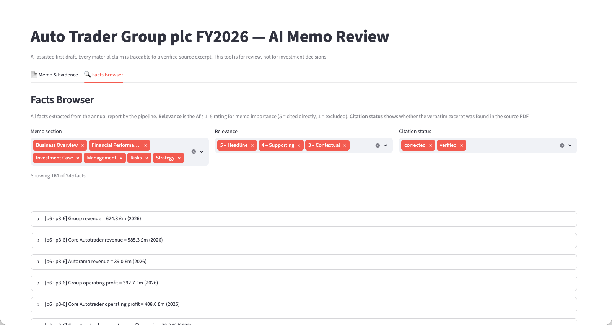
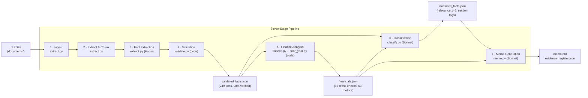

# Evidence-Grounded AI Investment Memo Assistant

A command-line pipeline that turns a company's annual report into a structured investment memo where every material claim is traceable to a verified source excerpt. Built as a portfolio project demonstrating how to use AI responsibly in a financial-analysis context.

> **AI reads and writes prose. Code counts and checks.**

**[Try the live demo →](https://memo-assistant.streamlit.app)**

![Memo & Evidence view — cited memo with inline [E-NNN] references and a source-excerpt panel](docs/screenshots/app-memo-evidence.png)
*Memo & Evidence view — cited memo with inline [E-NNN] references alongside the source-excerpt panel.*


*Facts Browser — filterable card view of all 249+ verified facts by memo section, relevance and citation status.*

---

## Live Demo

**[https://memo-assistant.streamlit.app](https://memo-assistant.streamlit.app)**

**Demo mode (no API key needed):** choose Auto Trader (V3 — evaluated), Greggs, or Games Workshop from the selector. The finished memo loads with the full evidence panel and facts browser — all powered by pre-committed output files.

**Run your own:** upload any UK-listed company annual report PDF and paste your own Anthropic API key. A deterministic pre-flight check runs first (text extractable, page count sensible, annual-report headings present, not a bank or insurer). If it passes, the full pipeline runs in 5–10 minutes and costs roughly **$1 of your API credits**. Your key is held in session memory only — never written to disk, never logged, removed when the run finishes.

---

## Problem

Investment analysts spend significant time reading hundreds of pages of company documents to answer a recurring set of questions: what does the business do, how is it performing, what could go wrong, and what needs further investigation?

LLMs can draft a memo in seconds — but a raw LLM output is unusable for real work because:
- Claims are not traceable to source documents
- Numbers may be invented or miscalculated
- Inference is not distinguished from documented fact
- Accuracy is assumed, not measured

This project solves those problems. Every material claim in the output memo cites a specific evidence register entry; every entry links to a document, page number, and verbatim excerpt that was string-matched against the source PDF.

---

## Intended User

An investment, private equity, corporate finance, or research analyst performing a first-pass review of a company. The tool prepares their work; it does not replace their judgement. It never produces a buy/sell recommendation or presents inference as fact.

---

## System Design

### Architecture

Seven stages in a straight line. Each stage produces a JSON artifact consumed by the next. Only Stage 2 reads raw PDFs. Stage 6 (memo generation) never sees raw documents — only validated, classified facts.



### AI vs. Deterministic Code

| Deterministic (code) | AI (Claude) |
|---|---|
| All arithmetic: growth rates, margins, ratios | Reading and interpreting document text |
| Period alignment and cross-checks | Classifying text into fact categories |
| Schema validation of every AI output | Summarising for the memo narrative |
| Citation resolution (does E-014 exist?) | Identifying risks and strengths from evidence |
| Number-match validation (memo vs. source) | Generating diligence questions |
| Cost and token logging | Connecting evidence into bull/bear arguments |

**The model never performs arithmetic.** Code validates the model's citations and numbers after every AI stage. Failures block the pipeline.

### Model Selection

| Stage | Model | Reason |
|---|---|---|
| Fact extraction | `claude-haiku-4-5` | Mechanical structured reading; ~4× cheaper than Sonnet |
| Classification | `claude-sonnet-5` | Analytical judgement required: relevance rating, memo section assignment |
| Memo generation | `claude-sonnet-5` | Synthesis and prose quality; constrained to validated inputs only |

### Storage

Plain JSON files on disk between stages. No database. Every artifact is inspectable and diffable with standard tools.

---

## Cost Engineering

Token economics were the primary design constraint, not an afterthought.

| Problem | Fix | Impact |
|---|---|---|
| Sonnet across all 146 pages | Haiku for extraction; Sonnet only for judgement tasks | ~4× cost reduction per extraction call |
| One API call per page | 3–5 pages per batch | Amortises prompt overhead across pages |
| No materiality bar: ~19 facts per page | Prompt targets 2–5 material facts per page | Output tokens (5× input price) controlled |
| All 146 pages extracted including governance boilerplate | Section filter: ~40 memo-relevant pages only | Reduces page count by ~70% |
| Re-running extraction after failures lost prior work | Resumable runs: skip already-extracted pages | No re-payment for completed work |
| Surprise costs | Pre-run cost estimator; abort if estimate > $3 | Predictable budget |

**Actual full-pipeline cost:**

| Stage | Auto Trader FY2026 | Greggs FY2025 | Games Workshop FY2025 |
|---|---|---|---|
| Fact extraction (Haiku, batched) | ~$0.05 | $0.28 | $0.17 |
| Classification (Sonnet) | $0.70 | $0.71 | $0.51 |
| Memo generation (Sonnet) | $0.14 | $0.15 | $0.13 |
| **Total** | **~$0.90** | **$1.33** | **$0.82** |

Extraction cost varies with memo-relevant page count (AT ~40, Greggs 53, GW 23). Classification and memo cost are similar across companies because they operate on validated facts, not raw PDFs.

---

## Evaluation Methodology

The gold standard set was built **before** prompt tuning and is frozen: `eval/gold_set.json` contains 50 items (20 facts, 10 risks, 10 observations, 10 diligence questions) compiled manually from the source documents. The pipeline was never tuned against it.

### V1 / V2 / V3 Results (scored against the same frozen gold set)

Three improvement rounds against the FY2026 Annual Report. Each round targeted diagnosed failure modes from the prior evaluation — no tuning against the gold set. Full detail: `eval/results.md`.

| Metric | V1 | V2 | V3 | Method |
|---|---|---|---|---|
| Fact recall (automated) | 18/20 (90%) | 18/20 (90%) | 18/20 (90%) | ±2% value tolerance; ±1 page citation tolerance |
| Citation accuracy (automated) | 16/18 (88%) | 16/18 (88%) | 16/18 (88%) | Of found facts |
| Risk coverage (human-verified) | 5.5/10 (55%) | 6.5/10 (65%) | **8.0/10 (80%)** | Manual review of Section 6 vs gold set R-01..R-10 |
| Observation coverage (human) | 7.5/10 (75%) | 9.0/10 (90%) | 9.0/10 (90%) | Manual review vs gold set O-01..O-10 |
| Diligence question quality (human) | 3.0/3.0 (100%) | 3.0/3.0 (100%) | 3.0/3.0 (100%) | 7 questions rated 1–3 |

**What changed each round:**
- **V2:** taxonomy floor bumping risk_disclosures facts to synthesis threshold (C1); explicit risk checklist in Section 6 prompt (C2); targeted synthesis focus questions for direct-traffic moat and EPS-vs-buyback mechanism (C3).
- **V3:** deterministic risk skeleton derived from company's own disclosed principal risks (C4); framing mandate requiring every category to appear as a failure scenario not an opportunity (C5); post-generation validator that blocks the pipeline if any skeleton keyword is absent from Section 6 (C6).

**Key V3 movements:** R-05 (cyber/IT) MISSING→COVERED — structural enforcement produced genuine risk analysis including GDPR exposure. R-10 (third-party) MISSING→PARTIAL — framing mandate produced explicit dependency risk framing. R-01 (macro) PARTIAL→COVERED. Zero risks fully absent for the first time.

**V3 regression:** R-09 (climate/EV) COVERED→PARTIAL. V2's richer synthesis narrative (ICE-to-EV transition, pay-per-mile tax, EV policy uncertainty) was replaced by a narrower skeleton-driven sub-section (GHG trajectory, compliance obligations). Structural enforcement guaranteed *presence*; it could not guarantee *breadth*.

**Evaluation closed at V3.** Remaining gaps (FCA/regulatory breadth, brand/fraud, climate EV-transition depth, third-party failure consequences) are analytical-breadth issues appropriate to human review — the tool's stated design intent. Further automated rounds risk overfitting to gold-set wording.

### Greggs Generalisation Test (Second Company)

After evaluation closed at V3, the full pipeline was run against Greggs plc FY2025 Annual Report — to validate that no component was hardcoded to Auto Trader. There was no gold set for Greggs; the success criteria were code-verified citation rate and zero validation errors, plus a qualitative analyst read of the finished memo.

**Pipeline results:**

| Metric | Result |
|---|---|
| Facts extracted | 252 |
| Citation verification rate | 249/252 (98%) |
| Memo reference errors | 0 |
| Memo number errors | 0 |
| Disclosed risk categories covered | 8/8 |
| Total cost | $1.33 |

**Five generalisation failures found and fixed** (all documented in `BUILD_LOG.md`):
1. **PDF sidebar** — Greggs' navigation sidebar appeared before body text in pdfplumber's reading order, defeating heading detection. Fixed: empty `heading_variants` + explicit `fallback_pages` in `greggs_config.yaml`.
2. **`extract.py` output path** — no `--out` flag for per-company output directories. Fixed.
3. **`finance.py` cross-checks** — universal checks all return WARN for a new company (expected; per-company checks need calibration from a first run).
4. **`memo.py` company identity** — `MEMO_SYSTEM`, header, and section writing instructions were hardcoded to Auto Trader. The generation model flagged a "data-integrity issue" and refused to write the memo. Fixed: config-driven templates; `--config` flag; `max_tokens` for sections 1–5 raised 4096 → 8192.
5. **Risk skeleton dedup** — "Financial" (fallback) and "Financial and market risk" (taxonomy) appeared as separate sub-sections. Fixed: generic word-subset dedup in `_dedupe_subset_labels()`.

**Qualitative review** (Zak Whatmough, 17 Jul 2026): [`eval/greggs_qualitative_review.md`](eval/greggs_qualitative_review.md) — overall 8.8–9.0/10. Verdict: "beyond an AI summary — it reads like a junior analyst's first draft that a senior analyst would edit before an investment committee." The memo captured Greggs-specific drivers (white space, Derby/Kettering investment cycle, GLP-1 as an emerging risk) rather than applying a generic template.

### Games Workshop Generalisation Test (Third Company)

After all Greggs findings were fixed, the pipeline was run against Games Workshop Group PLC (GAW) FY2025 Annual Report — a structurally different company (manufacturing and IP licensing; two-segment reporting: Core miniatures and Licensing royalties) — under a strict config-only rule: only `gw_config.yaml` and a `COMPANY_CROSS_CHECKS["gw"]` entry were permitted.

**Pipeline results:**

| Metric | Result |
|---|---|
| Facts extracted | 145 |
| Citation verification rate (pipeline) | 145/145 (100%) |
| Citation verification rate (stricter independent check) | 121/145 (83%) |
| Memo reference errors | 0 |
| Memo number errors | 0 |
| Disclosed risk categories covered | 4/4 |
| Total cost | $0.82 |

Note: the pipeline validator uses a 4-word fragment match with punctuation-stripped fallback. An independent exact-prefix check run during review found 121/145 passing the stricter criterion. Both figures are reported; the pipeline's 100% reflects verified-or-corrected under the production standard.

**Generalisation findings (documented in `BUILD_LOG.md`):**
1. **All section detection used fallback pages** — GW's "Principal risks" heading begins mid-page p18 (after the Section 172 statement); "STRATEGIC REPORT" is repeated across many non-consecutive pages. All three sections configured with `heading_variants: []` + explicit `fallback_pages`. No code change.
2. **`find_fact()` single-exclusion insufficient** — GW's two-segment structure (Core revenue, Licensing revenue, Total revenue) required excluding two labels to isolate the total. Added `_find_fact_multi_exclude()` helper accepting a list of exclusions. This is the one additive code change — new utility function, no logic changes to existing functions.

**Honest verdict: 99% config-only.** The third-company run required writing only a config file and two cross-check functions. No changes to extraction, validation, classification, or memo generation logic. The pipeline is demonstrably general-purpose.

**Qualitative review** (Zak Whatmough, 17 Jul 2026): [`eval/gw_qualitative_review.md`](eval/gw_qualitative_review.md) — overall 9.4/10, the strongest memo of the three. Verdict: "This no longer reads like an AI summary. It reads like a junior equity research analyst's first draft that requires editorial refinement rather than factual reconstruction."

**Critical finding — erroneous inference caught by human review:** The memo suggested EPS growth "may have been meaningfully supported by share count reduction / buybacks." The reviewer identified this as factually wrong: GW purchased zero shares in FY2025 (AR p.23). The claim was correctly labelled `inference=True` by the pipeline, sounded plausible (the same mechanism is genuinely true for Auto Trader), and passed every automated check — citation validation verifies quotes, not reasoning. It was caught by human domain knowledge: the exact mechanism the tool is designed around. Full analysis in `BUILD_LOG.md` and `eval/gw_qualitative_review.md`.

### Near-Misses

- **F-12** (£600m FY2027 return target): pipeline extracted the forward-guidance fact but the eval script matched a secondary value (£500m retailer segment revenue). Fact is present in pipeline output.
- **F-16** (ARPR £141 month-on-month increase): pipeline extracted £2,995 ARPR (the primary metric) but not the £141 increment as a standalone fact.
- **F-07** (EPS 34.17p): fact found, but pipeline cited page 4 vs. gold page 6 — EPS appears across multiple pages.
- **F-15** (13,942 forecourts): pipeline cited page 20, gold page 23 — outside ±1 tolerance.

### Evaluation Honesty

Both near-misses and citation misses are reported without cherry-picking. The error analysis and the before/after comparison are the most credible part of any evaluation — hiding failures eliminates the value of running one.

---

## V2 Roadmap

The headline theme from both qualitative reviews is the same: **synthesis, conviction and investment judgement**. The pipeline is accurate and well-structured; the next step is less about improving extraction and more about making the synthesis reach conclusions rather than report evidence.

> *"The next stage is less about improving extraction accuracy and more about improving synthesis, conviction and investment judgement."* — GW qualitative review

> *"It reads like a junior analyst's first draft that a senior analyst would edit before an investment committee."* — Greggs qualitative review

Items deferred from V1 evaluation, plus directions identified in both qualitative reviews:

| Item | Origin | Description |
|---|---|---|
| Synthesis → interpretation | Both reviews | Convert "evidence A, evidence B" framing into explicit investment interpretation ("here is why this changes my investment view") |
| Decisiveness: reduce hedging | GW review | "may suggest", "appears to", "could indicate" should mark genuine uncertainty, not every conclusion |
| Investment Verdict section | Both reviews | Optional closing conviction paragraph (high/medium/low, synthesis of bull/bear). Requires relaxing the no-recommendation constraint — a deliberate product decision. |
| Inference validation | GW review | Cross-check inferred mechanisms (e.g. buybacks, pricing power) against disclosed facts before including in synthesis — prevent the GW EPS/buyback class of error |
| Cost inflation analysis | Greggs review | Commodity costs (wheat, dairy, energy) and employment cost drivers (NICs, minimum wage) often implied but not made explicit |
| Per-company finance calibration | Generalisation | Write company-specific cross-checks against actual fact labels from first run (Greggs shop count; AT segment splits) |
| Multi-document support | Deferred | Ingest RNS announcements, investor presentations, half-year results alongside the annual report |
| Contradiction detection | Deferred | Flag where management commentary contradicts the quantitative evidence (e.g. "confident outlook" alongside falling margins) |
| Valuation module | Deferred | Deterministic EV/EBITDA and P/E multiples using extracted financials and market prices (out of scope for evidence-extraction V1) |
| Hosted demo | **Shipped in V1.1** | Streamlit demo app: three-company explorer plus bring-your-own-API-key "run your own company" mode with deterministic pre-flight suitability checks |

---

## Limitations

1. **Infographic pages:** pdfplumber cannot extract contiguous text from designed graphic layouts. Facts from KPI summary boxes are flagged `unverifiable` in the evidence register — they are correct but cannot be string-matched.
2. **Two-column body text:** pdfplumber interleaves columns in left-right reading order, breaking contiguous excerpt spans. Mitigated by a 4-word fragment matching fallback.
3. **Single document per run:** the pipeline does not compare across periods or against peer companies. Multi-document support is on the V2 roadmap.
4. **No OCR:** scanned PDFs are out of scope. The pipeline requires digitally-created PDFs.
5. **No real-time data:** the pipeline reads static documents; it does not fetch market prices, consensus estimates, or comparable company data.
6. **Analytical breadth vs. structural coverage:** V3's risk skeleton guarantees every disclosed risk category appears in Section 6, but guarantees *presence*, not *analytical depth*. The reviewer's contribution remains essential for framing risks as investment theses.
7. **Inference quality is not automatically validated:** the synthesis stage can produce plausible-but-wrong inferences that pass every automated check. Citation validation verifies that excerpts exist verbatim on cited pages; arithmetic cross-checks verify stated numbers; neither validates reasoning. An inference labelled `inference=True` by the pipeline may still be factually incorrect if the model applies a mechanism that is true for a peer but not for this company. Demonstrated concretely: the GW memo's EPS/buyback inference (caught by the reviewer; zero shares were repurchased in FY2025). Human review is a required stage, not a QA afterthought.
8. **Not investment advice:** the output is a structured first draft for analyst review. It must never be used as the basis for an investment decision without independent verification.

---

## Repository Structure

```
memo-assistant/
├── extract.py              # Stages 1–3: ingest, chunk, Haiku fact extraction
├── validate.py             # Stage 4: citation verification, auto-correction, excerpt matching
├── finance.py              # Stage 5a: deterministic cross-checks and ratio calculation
├── prior_year.py           # Stage 5b: prior-year value extraction from verified excerpts
├── classify.py             # Stage 6: Sonnet classification and analytical synthesis
├── memo.py                 # Stage 7: Sonnet memo generation with post-generation validator
├── section_filter.py       # Heading-based section detection (config-driven)
├── chunk.py                # PDF text extraction and page chunking (called by extract.py — not a pipeline stage itself)
├── llm.py                  # Thin Anthropic API wrapper (model strings pinned here)
├── app.py                  # Streamlit review app (memo + evidence browser)
├── schemas/                # Pydantic schemas for every pipeline artifact
├── config.yaml             # Auto Trader company configuration
├── greggs_config.yaml      # Greggs plc company configuration
├── gw_config.yaml          # Games Workshop Group PLC company configuration
├── tests/                  # Pytest suite (72 tests, all deterministic)
├── eval/
│   ├── gold_set.json       # 50-item manually built gold standard (frozen 14 Jul 2026)
│   ├── run_eval.py         # Evaluation harness
│   ├── results.md          # V1/V2/V3 scores and per-item detail
│   ├── greggs_qualitative_review.md  # Qualitative analyst read of Greggs memo
│   ├── gw_qualitative_review.md      # Qualitative analyst read of GW memo (incl. buyback-inference finding)
│   ├── v2_scoring_addendum.md        # V2 manual verdicts
│   ├── v3_scoring_addendum.md        # V3 manual verdicts (evaluation closed here)
│   └── scoring_sheet.md   # V1 human-judgement scoring sheet
├── output/
│   ├── memo.md             # Auto Trader V3 investment memo (V1-locked output)
│   ├── evidence_register.json  # Auto Trader evidence register
│   ├── greggs/
│   │   ├── memo.md         # Greggs plc investment memo
│   │   └── evidence_register.json  # Greggs evidence register
│   └── gw/
│       ├── memo.md         # Games Workshop investment memo
│       └── evidence_register.json  # Games Workshop evidence register
├── documents/              # Source PDFs (gitignored — large; publicly available)
├── DESIGN.md               # Architecture decisions and decision log
└── BUILD_LOG.md            # Honest record of every failure found and fixed
```

---

## Running the Pipeline

```bash
# Install dependencies
pip install -r requirements.txt

# Add your Anthropic API key
cp .env.example .env
# Edit .env: ANTHROPIC_API_KEY=sk-ant-...

# Place source PDFs in documents/
# Run each stage in order (Auto Trader example):
python extract.py documents/at-ar-fy26.pdf at-ar-fy26
python validate.py
python finance.py
python prior_year.py
python classify.py
python memo.py

# For a second company (Greggs example):
python extract.py documents/greggs-ar25.pdf greggs-ar25 --config greggs_config.yaml --out output/greggs/facts.json
python validate.py --facts output/greggs/facts.json --pdf documents/greggs-ar25.pdf --out output/greggs/validated_facts.json
python finance.py --facts output/greggs/validated_facts.json --out output/greggs/financials.json --company greggs
python prior_year.py --facts output/greggs/validated_facts.json --out output/greggs/prior_year_facts.json
python classify.py --facts output/greggs/validated_facts.json --financials output/greggs/financials.json --out output/greggs/classified_facts.json
python memo.py --classified output/greggs/classified_facts.json --financials output/greggs/financials.json --memo-out output/greggs/memo.md --register-out output/greggs/evidence_register.json --config greggs_config.yaml

# For a third company (Games Workshop example):
python extract.py documents/gw-ar25.pdf gw-ar25 --config gw_config.yaml --out output/gw/facts.json
python validate.py --facts output/gw/facts.json --pdf documents/gw-ar25.pdf --out output/gw/validated_facts.json
python finance.py --facts output/gw/validated_facts.json --out output/gw/financials.json --company gw
python prior_year.py --facts output/gw/validated_facts.json --out output/gw/prior_year_facts.json
python classify.py --facts output/gw/validated_facts.json --financials output/gw/financials.json --out output/gw/classified_facts.json
python memo.py --classified output/gw/classified_facts.json --financials output/gw/financials.json --validated output/gw/validated_facts.json --prior-year output/gw/prior_year_facts.json --memo-out output/gw/memo.md --register-out output/gw/evidence_register.json --config gw_config.yaml

# Review the output
streamlit run app.py

# Run tests
python -m pytest tests/

# Score against gold set (Auto Trader only — gold set is AT-specific)
python eval/run_eval.py
```

---

## Go-Live Checklist

### Security

- [x] `.env` has never entered git history (verified: `git log --all --full-history -- .env` returns nothing; the 3 occurrences of "sk-ant" in `git log -p` are all in `.env.example` and README — placeholders, not real keys)
- [x] `.env` is in `.gitignore`; no API key appears in any committed file
- [x] `.env.example` documents required variables without real values

### Data

- [x] `documents/*.pdf` is gitignored (large files, publicly available)
- [x] `output/` is gitignored with explicit exceptions for demo outputs (memos, evidence registers, classified facts, validated facts for all three companies)
- [x] `eval/gold_set.json` committed and unmodified since freeze date (14 Jul 2026)

### Example Outputs Committed

```gitignore
# In .gitignore — exceptions for the Streamlit demo (no API key needed):
!output/memo.md
!output/evidence_register.json
!output/classified_facts.json
!output/validated_facts.json
!output/greggs/  (+ memo, register, classified, validated)
!output/gw/      (+ memo, register, classified, validated)
```

Files committed (all are public-document derivatives — the source PDFs are publicly available):
- `output/memo.md` + `evidence_register.json` + `classified_facts.json` + `validated_facts.json` — Auto Trader V3
- `output/greggs/` — Greggs plc (all four files)
- `output/gw/` — Games Workshop (all four files)

### Streamlit Demo

- [x] `app.py` V1.1 — demo mode (three companies, no API key) + "run your own" mode (PDF upload + API key + pre-flight check + pipeline runner)
- [x] Streamlit Community Cloud deployed: https://memo-assistant.streamlit.app

### Evaluation

- [x] `eval/results.md` V1/V2/V3 manual metrics complete
- [x] `eval/scoring_sheet.md` Part C (risk coverage) completed
- [x] `eval/greggs_qualitative_review.md` recorded
- [x] `eval/gw_qualitative_review.md` recorded
- [x] `BUILD_LOG.md` up to date through V3 + Greggs + GW + V1.1 app
