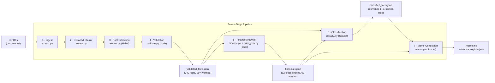

# Evidence-Grounded AI Investment Memo Assistant

A command-line pipeline that turns a company's annual report into a structured investment memo where every material claim is traceable to a verified source excerpt. Built as a portfolio project demonstrating how to use AI responsibly in a financial-analysis context.

> **AI reads and writes prose. Code counts and checks.**

---

## Problem

Investment analysts spend significant time reading hundreds of pages of company documents to answer a recurring set of questions: what does the business do, how is it performing, what could go wrong, and what needs further investigation?

LLMs can draft a memo in seconds — but a raw LLM output is unusable for real work because:
- Claims are not traceable to source documents
- Numbers may be invented or miscalculated
- Inference is not distinguished from documented fact
- Accuracy is assumed, not measured

This project solves those problems. Every material claim in the output memo cites a specific evidence register entry; every entry links to a document, page number, and verbatim excerpt that was string-matched against the source PDF.

---

## Intended User

An investment, private equity, corporate finance, or research analyst performing a first-pass review of a company. The tool prepares their work; it does not replace their judgement. It never produces a buy/sell recommendation or presents inference as fact.

---

## System Design

### Architecture

Seven stages in a straight line. Each stage produces a JSON artifact consumed by the next. Only Stage 2 reads raw PDFs. Stage 6 (memo generation) never sees raw documents — only validated, classified facts.



### AI vs. Deterministic Code

| Deterministic (code) | AI (Claude) |
|---|---|
| All arithmetic: growth rates, margins, ratios | Reading and interpreting document text |
| Period alignment and cross-checks | Classifying text into fact categories |
| Schema validation of every AI output | Summarising for the memo narrative |
| Citation resolution (does E-014 exist?) | Identifying risks and strengths from evidence |
| Number-match validation (memo vs. source) | Generating diligence questions |
| Cost and token logging | Connecting evidence into bull/bear arguments |

**The model never performs arithmetic.** Code validates the model's citations and numbers after every AI stage. Failures block the pipeline.

### Model Selection

| Stage | Model | Reason |
|---|---|---|
| Fact extraction | `claude-haiku-4-5` | Mechanical structured reading; ~4× cheaper than Sonnet |
| Classification | `claude-sonnet-5` | Analytical judgement required: relevance rating, memo section assignment |
| Memo generation | `claude-sonnet-5` | Synthesis and prose quality; constrained to validated inputs only |

### Storage

Plain JSON files on disk between stages. No database. Every artifact is inspectable and diffable with standard tools.

---

## Cost Engineering

Token economics were the primary design constraint, not an afterthought.

| Problem | Fix | Impact |
|---|---|---|
| Sonnet across all 146 pages | Haiku for extraction; Sonnet only for judgement tasks | ~4× cost reduction per extraction call |
| One API call per page | 3–5 pages per batch | Amortises prompt overhead across pages |
| No materiality bar: ~19 facts per page | Prompt targets 2–5 material facts per page | Output tokens (5× input price) controlled |
| All 146 pages extracted including governance boilerplate | Section filter: ~40 memo-relevant pages only | Reduces page count by ~70% |
| Re-running extraction after failures lost prior work | Resumable runs: skip already-extracted pages | No re-payment for completed work |
| Surprise costs | Pre-run cost estimator; abort if estimate > $3 | Predictable budget |

**Actual full-pipeline cost (FY2026 Annual Report):**

| Stage | Cost |
|---|---|
| Fact extraction (Haiku, 40 pages, batched) | ~$0.05 |
| Classification (Sonnet, 249 facts in batches of 80) | $0.70 |
| Memo generation (Sonnet, two-call strategy) | $0.14 |
| **Total** | **~$0.90** |

---

## Evaluation Methodology

The gold standard set was built **before** prompt tuning and is frozen: `eval/gold_set.json` contains 50 items (20 facts, 10 risks, 10 observations, 10 diligence questions) compiled manually from the source documents. The pipeline was never tuned against it.

### V1 / V2 / V3 Results (scored against the same frozen gold set)

Three improvement rounds have been run against the FY2026 Annual Report, each targeting diagnosed failure modes from the prior evaluation. Full detail: `eval/results.md`.

| Metric | V1 | V2 | V3 | Method |
|---|---|---|---|---|
| Fact recall (automated) | 18/20 (90%) | 18/20 (90%) | 18/20 (90%) | ±2% value tolerance; ±1 page citation tolerance |
| Citation accuracy (automated) | 16/18 (88%) | 16/18 (88%) | 16/18 (88%) | Of found facts |
| Risk coverage (human-verified) | 5.5/10 (55%) | 6.5/10 (65%) | pending | Manual review of Section 6 vs gold set R-01..R-10 |
| Observation coverage (human) | 7.5/10 (75%) | 9.0/10 (90%) | pending | Manual review vs gold set O-01..O-10 |
| Diligence question quality (human) | 3.0/3.0 (100%) | 3.0/3.0 (100%) | pending | 7 questions rated 1–3 |

> Automated risk coverage (V1: 9/10, V2: 10/10 apparent, V3: 10/10) is unreliable — common business vocabulary produces false positives. Human-verified scores override automated. V3 R-05 and R-10 now have genuine keyword matches ("cyber", "security", "third", "reliance") rather than V2's false positives — manual verification pending.

**What V2 improved:** direct-traffic competitive moat and EPS-vs-buyback mechanism now explicit (C3); all 11 synthesis risks now in Section 6 (C2); climate/EV risk now addressed. **What V3 improved:** Section 6 structure is now derived deterministically from the company's own disclosed risk categories; a post-generation validator fails if any category is absent; synthesis prompt mandates explicit risk framing (not opportunity framing) for every category. Primary targets: R-05 (cyber/IT) and R-10 (third-party/partner reliance). **Persistent gap:** engagement quality (O-08) — structural pdfplumber limitation on infographic pages; no pipeline fix available without OCR.

### Near-Misses

- **F-12** (£600m FY2027 return target): pipeline extracted the forward-guidance fact but the eval script matched a secondary value (£500m retailer segment revenue). Fact is present in pipeline output.
- **F-16** (ARPR £141 month-on-month increase): pipeline extracted £2,995 ARPR (the primary metric) but not the £141 increment as a standalone fact.
- **F-07** (EPS 34.17p): fact found, but pipeline cited page 4 vs. gold page 6 — EPS appears across multiple pages.
- **F-15** (13,942 forecourts): pipeline cited page 20, gold page 23 — outside ±1 tolerance.

### Evaluation Honesty

Both near-misses and citation misses are reported without cherry-picking. The error analysis and the before/after comparison are the most credible part of any evaluation — hiding failures eliminates the value of running one.

---

## Limitations

1. **Infographic pages:** pdfplumber cannot extract contiguous text from designed graphic layouts. Five facts from KPI summary boxes are flagged `unverifiable` in the evidence register — they are correct but cannot be string-matched.
2. **Two-column body text:** pdfplumber interleaves columns in left-right reading order, which breaks contiguous excerpt spans. Mitigated by a 4-word fragment matching fallback.
3. **Single document, single company:** V1 covers one annual report. The pipeline does not compare across periods or companies.
4. **No OCR:** scanned PDFs are out of scope. The pipeline requires digitally-created PDFs.
5. **No real-time data:** the pipeline reads static documents; it does not fetch market prices, consensus estimates, or comparable company data.
6. **Not investment advice:** the output is a structured first draft for analyst review. It must never be used as the basis for an investment decision without independent verification.

---

## Repository Structure

```
memo-assistant/
├── extract.py          # Stages 1–3: ingest, chunk, Haiku fact extraction
├── validate.py         # Stage 4: citation verification, auto-correction, excerpt matching
├── finance.py          # Stage 5a: deterministic cross-checks and ratio calculation
├── prior_year.py       # Stage 5b: prior-year value extraction from verified excerpts
├── classify.py         # Stage 6: Sonnet classification and analytical synthesis
├── memo.py             # Stage 7: Sonnet memo generation with post-generation validator
├── llm.py              # Thin Anthropic API wrapper (model strings pinned here)
├── app.py              # Streamlit review app (memo + evidence browser)
├── schemas/            # Pydantic schemas for every pipeline artifact
├── prompts/            # Extraction and generation prompt templates
├── eval/
│   ├── gold_set.json   # 50-item manually built gold standard (frozen)
│   ├── run_eval.py     # Evaluation harness
│   ├── results.md      # Automated metric scores and per-item detail
│   └── scoring_sheet.md # Human-judgement scoring template
├── documents/          # Source PDFs (gitignored — large; publicly available)
├── output/             # Pipeline artifacts (gitignored — regenerable)
├── DESIGN.md           # Architecture decisions and decision log
└── BUILD_LOG.md        # Honest record of every failure found and fixed
```

---

## Running the Pipeline

```bash
# Install dependencies
pip install -r requirements.txt

# Add your Anthropic API key
cp .env.example .env
# Edit .env: ANTHROPIC_API_KEY=sk-ant-...

# Place source PDFs in documents/
# Run each stage in order:
python extract.py
python validate.py
python finance.py
python prior_year.py
python classify.py
python memo.py

# Review the output
streamlit run app.py

# Score against gold set
python eval/run_eval.py
```

---

## Go-Live Checklist

### Security

- [ ] Verify `.env` has never entered git history: `git log --all --full-history -- .env` should return nothing
- [ ] Confirm `.env` is in `.gitignore` and no API key appears in any committed file: `git grep -i "sk-ant"` should return nothing
- [ ] Check `.env.example` documents required variables without real values

### Data

- [ ] Confirm `documents/*.pdf` is gitignored (large files, publicly available)
- [ ] Confirm `output/` is gitignored (regenerable artifacts)
- [ ] Verify `eval/gold_set.json` is committed and unmodified since freeze date (14 Jul 2026)

### Example Outputs Worth Committing

The `output/` directory is gitignored by default (artifacts are regenerable). For portfolio purposes, consider adding exceptions for a small set of read-only showcase files:

```gitignore
# In .gitignore — add to track specific output files:
!output/memo.md
!output/evidence_register.json
```

Files worth tracking:
- `output/memo.md` — the generated memo (primary deliverable)
- `output/evidence_register.json` — the evidence register (demonstrates citation architecture)

The following are large or contain intermediate-stage detail better left gitignored:
- `output/validated_facts.json` (~250 facts, verbose)
- `output/classified_facts.json` (~250 facts + analytical synthesis)
- `output/financials.json` (useful for debugging; not a portfolio asset)

### Evaluation

- [ ] `eval/results.md` manual metrics section filled in
- [ ] `eval/scoring_sheet.md` Part C (risk coverage verification) completed
- [ ] `BUILD_LOG.md` up to date with any failures found during final review
